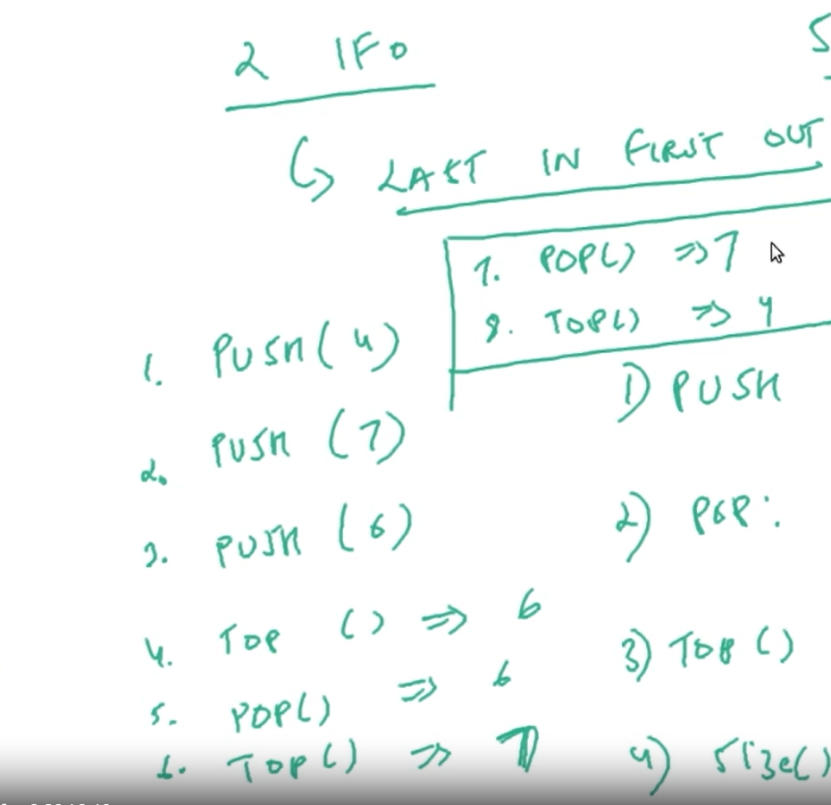

# STACKS-DSA
Stacks-java-script

| NO. | Questions                                                                                                                                                                  |
| --- | ----------------------------------------------------------------------------------------------------------------------------------------------------------------------------------------------------------------------------------------------- |   
|     |   Stacks-types                                                                                                                                                             |
|  1  | [what is stack](#)                                                                                                                                                         |
|  2  | [Using-stack-as-an-array](#)                                                                                                                                               |
|  3  | [Using-stack-as-a-linked-list](#)                                                                                                                                          |
|  4  | [Using-stack-as-a-linked-List-implementation](#)                                                                                                                           |

|  1  | [what is stack](#)  
# 1.1 what is stack

# 1.2 stack explanation

# 1.3 stack : LIFO

|  2  | [Using-stack-as-an-array](#)   

# 2.1 stack as array

# 2.2 stack as array

|  3  | [Using-stack-as-a-linked-list](#)   

# 3.1 using as a linked list

