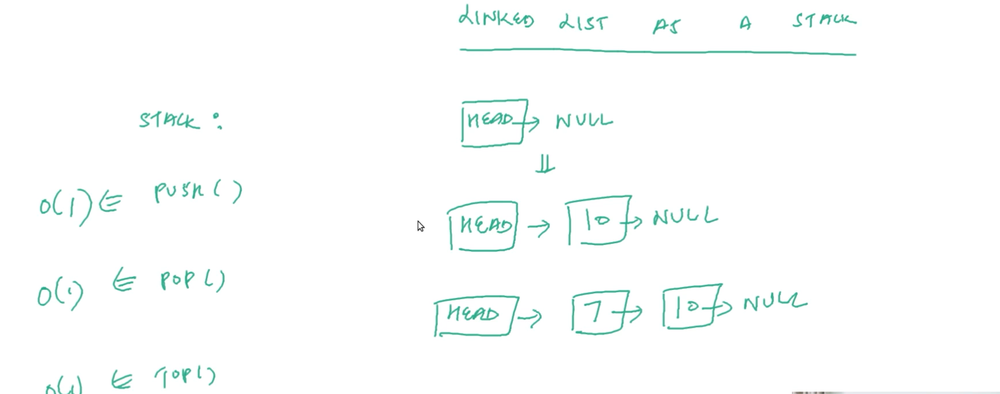

# STACKS-DSA
Stacks-java-script

| NO. | Questions                                                                                                                                                                  |
| --- | ----------------------------------------------------------------------------------------------------------------------------------------------------------------------------------------------------------------------------------------------- |   
|     |   Stacks-types                                                                                                                                                             |
|  1  | [what is stack](#)                                                                                                                                                         |
|  2  | [Using-stack-as-an-array](#)                                                                                                                                               |
|  3  | [Using-stack-as-a-linked-list](#)                                                                                                                                          |
|  4  | [Using-stack-as-a-linked-List-implementation](#)                                                                                                                           |

|  1  | [what is stack](#)  
# 1.1 what is stack

 Stack we called it has 'ADT' 

 ADT:  'Abstract Data Type 

 while implementing data types into 'Stack' we need to fallow this 4 points 

<li>  PUSH: Insert into stack
   <li>   POP: Pop from the stack
   <li>   TOP: Return TOP most element of the stack( top most means last element LIFO)
   <li>   SIZE: Return size of the stack </li>

   
  

# 1.2 stack explanation

 For instance in Stack push[4] push[7] push[6] =>[4,7,6] 

 <li> Top () => 6 :Return TOP most element of the stack ( Top most means last element LIFO)</li>
    <li> Pop () => 6 :POP: Pop from the stack (Come out of the Stack)</li>

 

 <li> Top () => 7 :Return TOP most element of the stack( top most means last element LIFO)</li>
    <li> Pop () => 7 :POP: Pop from the stack (Come out of the Stack) 
</li>

 <li> Top () => 4 :Returns Top most element is '4' </li>
   

# 1.3 stack : LIFO

|  2  | [Using-stack-as-an-array](#)   

# 2.1 stack as array

# 2.2 stack as array

|  3  | [Using-stack-as-a-linked-list](#)   

# 3.1 using as a linked list

| 4   |  [Using-stack-as-an-array](#)   

# 4.1 usingStackanArray

# 4.2 usingSrackanArray

